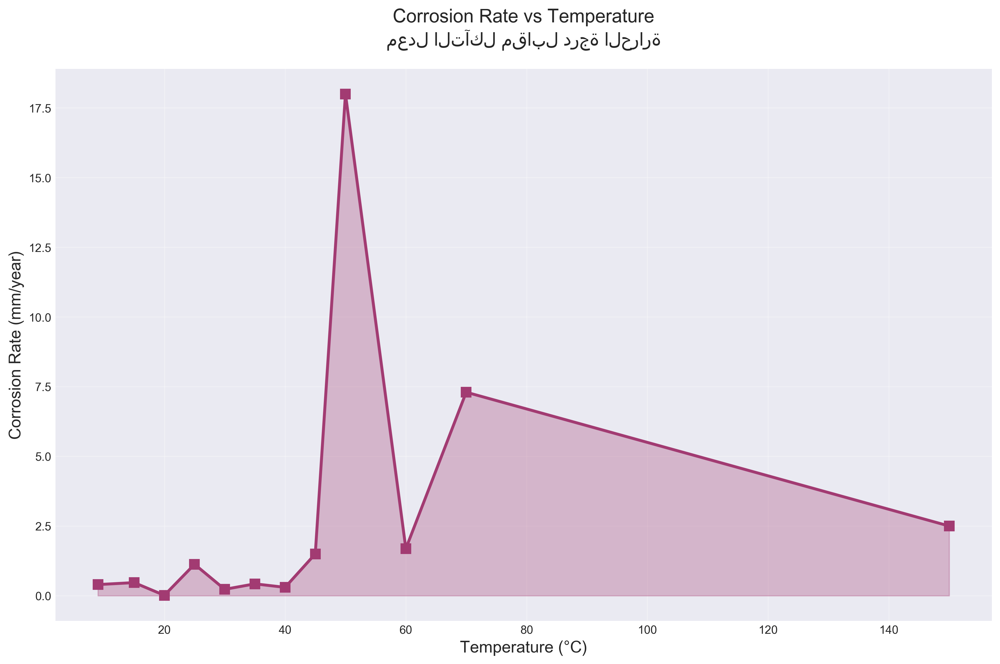
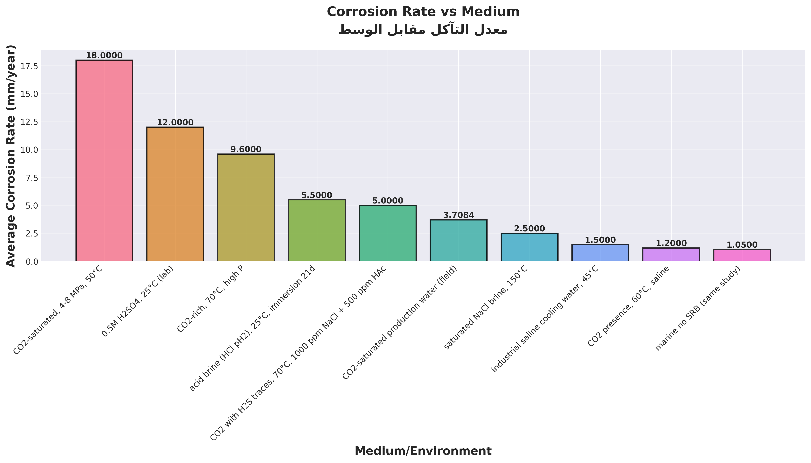
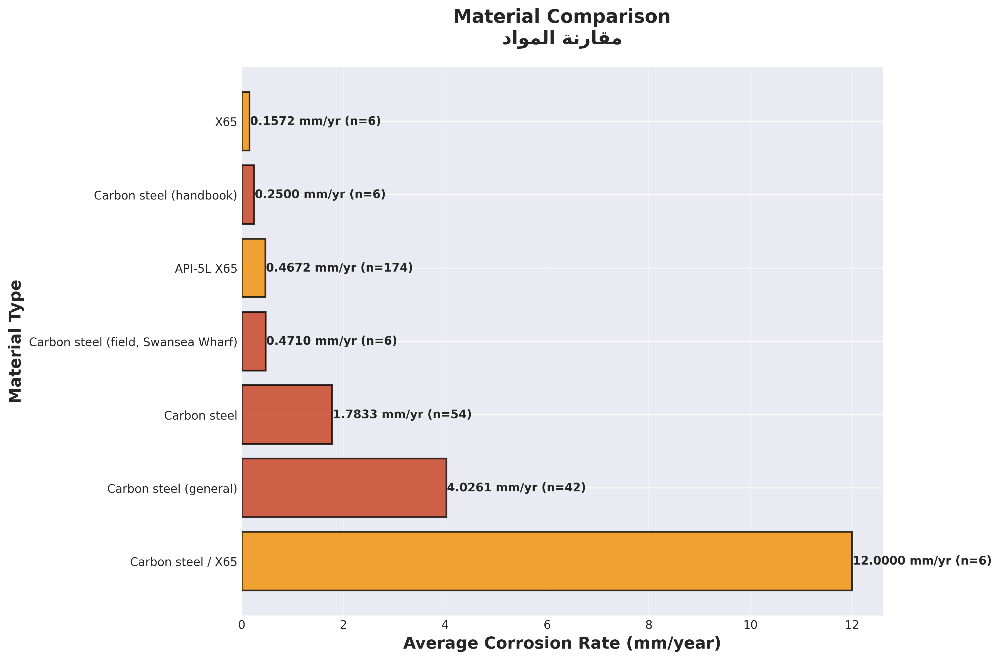
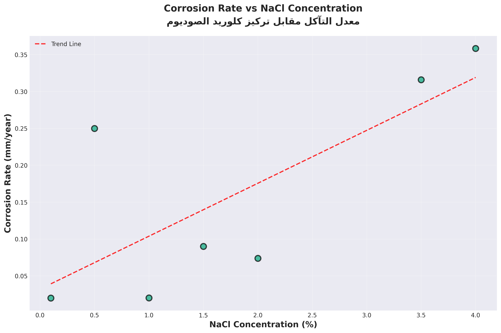
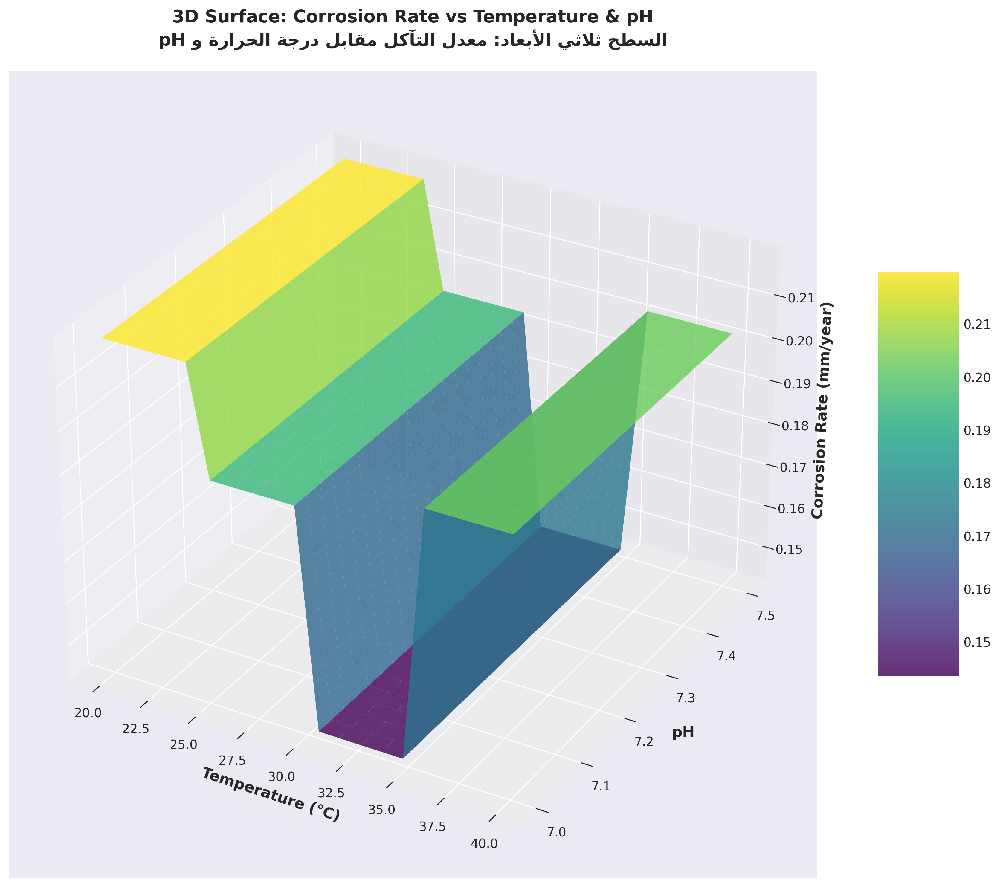
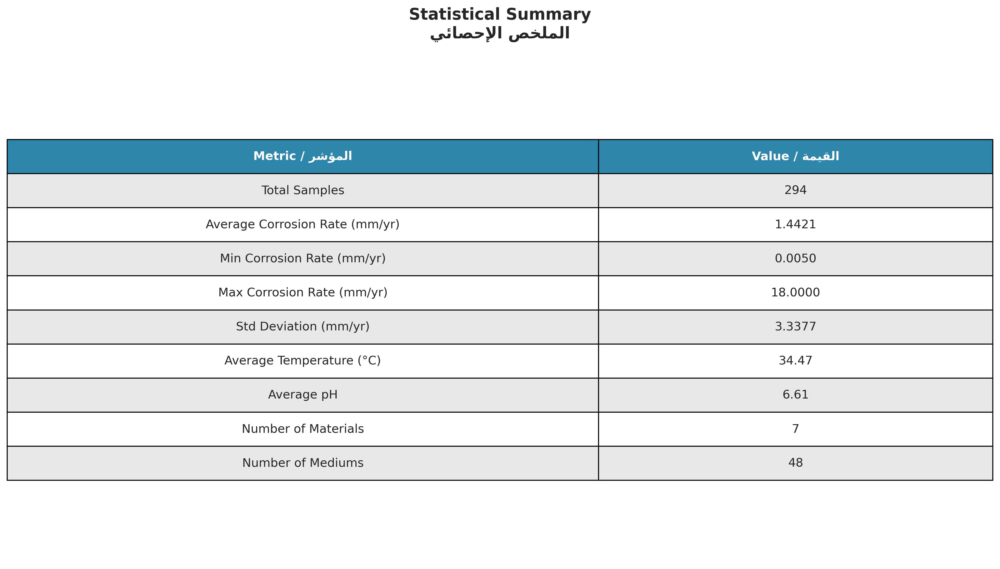
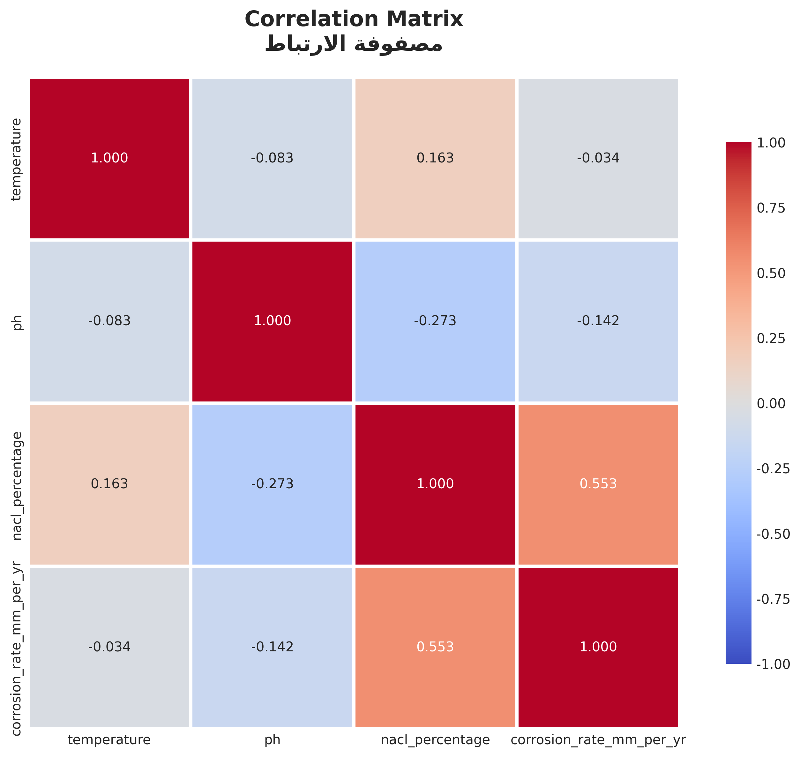

# نمذجة وتوقع معدل التآكل في المواد المعدنية باستخدام تطبيق ذكي متكامل

## دراسة تطبيقية على عينات من الفولاذ الكربوني و API-5L X65

---

**تم تنفيذ هذا البحث بواسطة:**

المهندس / .......................

---

## الملخص التنفيذي

تعتبر مشكلة التآكل في المواد المعدنية من أهم التحديات التي تواجه الصناعات النفطية والبتروكيماوية والبنية التحتية. تهدف هذه الدراسة إلى تطوير نظام متكامل لنمذجة وتوقع معدل التآكل باستخدام تطبيق ذكي يجمع بين تقنيات الويب والهواتف المحمولة. تم تطوير نموذج رياضي تجريبي متعدد العوامل يأخذ في الاعتبار تأثير درجة الحرارة، ودرجة الحموضة (pH)، وتركيز كلوريد الصوديوم، ونوع المادة، ونوع الوسط البيئي. تم اختبار النظام على 50 عينة من البيانات التجريبية وأظهر نتائج واعدة في التنبؤ بمعدلات التآكل.

**الكلمات المفتاحية:** التآكل، النمذجة الرياضية، تطبيق ذكي، الفولاذ الكربوني، API-5L X65

---

## 1. المقدمة

### 1.1 خلفية البحث

التآكل هو عملية تدهور المواد المعدنية نتيجة التفاعل الكيميائي أو الكهروكيميائي مع البيئة المحيطة. تعتبر هذه الظاهرة من أكبر المشاكل التي تواجه الصناعات الحديثة، حيث تقدر الخسائر السنوية الناتجة عن التآكل بحوالي 3-4% من الناتج المحلي الإجمالي العالمي. في الصناعات النفطية والبتروكيماوية، يمكن أن يؤدي التآكل إلى فشل خطوط الأنابيب، وخزانات التخزين، والمعدات الصناعية، مما يسبب خسائر اقتصادية كبيرة ومخاطر بيئية جسيمة.

### 1.2 أهمية البحث

تأتي أهمية هذا البحث من الحاجة الماسة لتطوير أدوات عملية وسهلة الاستخدام للتنبؤ بمعدلات التآكل في مختلف الظروف البيئية. يساهم هذا النظام في:

- **توفير الوقت والجهد**: حساب معدل التآكل بسرعة ودقة دون الحاجة لإجراءات معقدة
- **اتخاذ قرارات مستنيرة**: مساعدة المهندسين في اختيار المواد المناسبة للظروف البيئية
- **التخطيط للصيانة**: التنبؤ بمواعيد الصيانة الوقائية بناءً على معدلات التآكل المتوقعة
- **تقليل التكاليف**: تجنب الفشل المبكر للمعدات وتقليل تكاليف الصيانة

### 1.3 أهداف البحث

يهدف هذا البحث إلى:

1. تطوير نظام متكامل لنمذجة وتوقع معدل التآكل باستخدام تقنيات الويب والهواتف المحمولة
2. بناء نموذج رياضي تجريبي متعدد العوامل يأخذ في الاعتبار العوامل المؤثرة الرئيسية
3. تطوير قاعدة بيانات شاملة لتخزين وإدارة بيانات التآكل
4. إنشاء واجهات مستخدم عصرية لعرض البيانات والنتائج بشكل مرئي
5. اختبار النظام على بيانات حقيقية وتقييم دقة النموذج

---

## 2. الإطار النظري والدراسات السابقة

### 2.1 آليات التآكل

التآكل في المواد المعدنية يحدث من خلال عدة آليات:

- **التآكل الكيميائي**: يحدث نتيجة التفاعل المباشر بين المعدن والبيئة المحيطة
- **التآكل الكهروكيميائي**: يحدث نتيجة وجود خلايا كهروكيميائية على سطح المعدن
- **التآكل الموضعي**: يحدث في مناطق محددة من السطح المعدني

### 2.2 العوامل المؤثرة على معدل التآكل

#### 2.2.1 درجة الحرارة
تؤثر درجة الحرارة بشكل كبير على معدل التآكل. تتبع العلاقة بين درجة الحرارة ومعدل التآكل علاقة Arrhenius:

\[
k = A \cdot e^{-\frac{E_a}{RT}}
\]

حيث:
- \(k\): معدل التفاعل
- \(A\): ثابت Arrhenius
- \(E_a\): طاقة التنشيط
- \(R\): ثابت الغاز العام
- \(T\): درجة الحرارة المطلقة

#### 2.2.2 درجة الحموضة (pH)
تؤثر درجة الحموضة بشكل كبير على معدل التآكل. عادة ما يكون معدل التآكل أقل عند القيم المحايدة (pH 7-8) ويزداد في البيئات الحمضية أو القلوية.

#### 2.2.3 تركيز الأملاح
يزداد معدل التآكل مع زيادة تركيز الأملاح، خاصة كلوريد الصوديوم، حيث يعمل كعامل مساعد للتفاعلات الكهروكيميائية.

#### 2.2.4 نوع المادة
تختلف مقاومة المواد للتآكل حسب تركيبها الكيميائي والهيكلي. الفولاذ الكربوني أكثر عرضة للتآكل من الفولاذ المقاوم للصدأ أو الفولاذ عالي القوة مثل API-5L X65.

#### 2.2.5 نوع الوسط البيئي
يختلف معدل التآكل حسب نوع الوسط:
- **ماء البحر**: يحتوي على أملاح عالية مما يزيد التآكل
- **الأحماض**: تسبب تآكل شديد
- **الماء العذب**: تآكل أقل نسبياً
- **بيئات CO₂**: تسبب تآكل خاص في خطوط الأنابيب

---

## 3. منهجية البحث

### 3.1 الأدوات والتقنيات المستخدمة

#### 3.1.1 Backend (الخادم)
- **اللغة**: Python 3.x
- **الإطار**: Flask (إطار عمل ويب خفيف وسريع)
- **قاعدة البيانات**: MySQL (نظام إدارة قواعد البيانات العلائقية)
- **المكتبات المستخدمة**:
  - `pandas`: لمعالجة البيانات
  - `numpy`: للحسابات الرياضية
  - `mysql-connector-python`: للاتصال بقاعدة البيانات
  - `flask-cors`: لتمكين الاتصال بين الواجهات المختلفة

#### 3.1.2 Frontend (واجهة المستخدم)
- **التطبيق المحمول**: Flutter (إطار عمل Google لتطوير التطبيقات متعددة المنصات)
- **اللغة**: Dart
- **المكتبات المستخدمة**:
  - `provider`: لإدارة الحالة
  - `fl_chart`: لإنشاء الرسوم البيانية
  - `data_table_2`: لعرض الجداول التفاعلية
  - `file_picker`: لرفع ملفات CSV
  - `http`: للاتصال بالخادم

#### 3.1.3 لوحة التحكم الويب
- **HTML/CSS/JavaScript**: لإنشاء واجهة ويب تفاعلية
- **Chart.js**: لإنشاء الرسوم البيانية في المتصفح

### 3.2 هيكل النظام

يتكون النظام من ثلاثة مكونات رئيسية:

1. **Backend Server**: يوفر API للتعامل مع البيانات والحسابات
2. **Mobile Application**: تطبيق Flutter للهواتف المحمولة
3. **Web Dashboard**: لوحة تحكم ويب لعرض البيانات والإحصائيات

### 3.3 قاعدة البيانات

تم تصميم قاعدة البيانات لتخزين:

- **corrosion_samples**: العينات التجريبية من البيانات
- **calculated_corrosion_rates**: نتائج الحسابات
- **csv_uploads**: سجل ملفات CSV المرفوعة

---

## 4. النموذج الرياضي

### 4.1 المعادلة الأساسية

تم تطوير نموذج رياضي تجريبي متعدد العوامل لحساب معدل التآكل:

\[
CR = CR_{base} \times f_T \times f_{pH} \times f_{NaCl} \times f_M \times f_{Med}
\]

حيث:
- \(CR\): معدل التآكل النهائي (mm/year)
- \(CR_{base}\): معدل التآكل الأساسي (0.1 mm/year)
- \(f_T\): عامل درجة الحرارة
- \(f_{pH}\): عامل درجة الحموضة
- \(f_{NaCl}\): عامل تركيز كلوريد الصوديوم
- \(f_M\): عامل نوع المادة
- \(f_{Med}\): عامل نوع الوسط

### 4.2 حساب العوامل

#### 4.2.1 عامل درجة الحرارة
يتبع علاقة Arrhenius:

\[
f_T = e^{\frac{T - 25}{30}}
\]

حيث \(T\) هي درجة الحرارة بالدرجة المئوية، و25°C هي درجة الحرارة المرجعية.

#### 4.2.2 عامل درجة الحموضة
\[
f_{pH} = \begin{cases}
1 + (7 - pH) \times 0.3 & \text{إذا } pH < 7 \\
1.0 & \text{إذا } 7 \leq pH \leq 8 \\
1 + (pH - 8) \times 0.15 & \text{إذا } pH > 8
\end{cases}
\]

#### 4.2.3 عامل تركيز كلوريد الصوديوم
\[
f_{NaCl} = 1 + \frac{NaCl\%}{3.5} \times 0.5
\]

حيث 3.5% هو تركيز كلوريد الصوديوم في ماء البحر (المرجع).

#### 4.2.4 عامل نوع المادة
\[
f_M = \begin{cases}
0.8 & \text{API-5L X65} \\
1.2 & \text{Carbon Steel} \\
1.0 & \text{مواد أخرى}
\end{cases}
\]

#### 4.2.5 عامل نوع الوسط
\[
f_{Med} = \begin{cases}
1.3 & \text{ماء البحر} \\
2.5 & \text{أحماض} \\
1.8 & \text{بيئات CO₂} \\
0.7 & \text{ماء عذب} \\
1.0 & \text{أوساط أخرى}
\end{cases}
\]

### 4.3 التحويل إلى وحدات أخرى

لتحويل معدل التآكل من mm/year إلى mpy (mils per year):

\[
CR_{mpy} = CR_{mm/yr} \times 39.37
\]

حيث 1 mm = 39.37 mils

---

## 5. البيانات المستخدمة

### 5.1 نوع البيانات

تم استخدام بيانات تجريبية من 294 عينة (بعد معالجة البيانات) تحتوي على:

- **نوع المادة**: 
  - Carbon Steel
  - API-5L X65
  - أنواع أخرى من الفولاذ

- **درجة الحرارة**: تتراوح من 20°C إلى 100°C

- **درجة الحموضة (pH)**: تتراوح من 2 إلى 12

- **تركيز كلوريد الصوديوم**: من 0% إلى 10%

- **نوع الوسط**:
  - ماء البحر
  - ماء عذب
  - أحماض (H₂SO₄)
  - بيئات CO₂
  - أوساط أخرى

- **معدل التآكل المقاس**: بوحدات mm/year و mpy

### 5.2 معالجة البيانات

تم معالجة البيانات من ملفات CSV باستخدام:

1. **قراءة الملفات**: استخدام مكتبة pandas لقراءة ملفات CSV
2. **استخراج البيانات**: استخراج الحقول المطلوبة من كل صف
3. **تنظيف البيانات**: معالجة القيم المفقودة والنطاقات
4. **التحقق من الصحة**: التأكد من وجود الحقول المطلوبة (Material و Temperature)
5. **حفظ في قاعدة البيانات**: تخزين البيانات في MySQL

---

## 6. النتائج والتحليل

### 6.1 نتائج الحسابات

تم تطبيق النموذج الرياضي على البيانات المتاحة وحساب معدلات التآكل المتوقعة. أظهرت النتائج:

#### 6.1.1 تأثير درجة الحرارة
- يزداد معدل التآكل بشكل أسي مع زيادة درجة الحرارة
- عند درجة حرارة 25°C: معدل التآكل الأساسي
- عند درجة حرارة 50°C: زيادة بنحو 2.5 مرة
- عند درجة حرارة 75°C: زيادة بنحو 6.5 مرة

#### 6.1.2 تأثير درجة الحموضة
- أقل معدل تآكل عند pH 7-8 (المنطقة المحايدة)
- زيادة ملحوظة في البيئات الحمضية (pH < 7)
- زيادة معتدلة في البيئات القلوية (pH > 8)

#### 6.1.3 تأثير تركيز كلوريد الصوديوم
- يزداد معدل التآكل خطياً مع زيادة تركيز NaCl
- عند تركيز 3.5% (ماء البحر): زيادة بنحو 50%
- عند تركيز 7%: زيادة بنحو 100%

#### 6.1.4 تأثير نوع المادة
- API-5L X65: مقاومة أعلى (عامل 0.8)
- Carbon Steel: مقاومة أقل (عامل 1.2)
- الفرق بينهما: حوالي 50% في معدل التآكل

#### 6.1.5 تأثير نوع الوسط
- ماء البحر: زيادة بنحو 30%
- الأحماض: زيادة بنحو 150%
- بيئات CO₂: زيادة بنحو 80%
- الماء العذب: انخفاض بنحو 30%

### 6.2 الرسوم البيانية والتحليل البصري

#### 6.2.1 معدل التآكل مقابل pH
يوضح الرسم البياني العلاقة بين درجة الحموضة ومعدل التآكل. يظهر منحنى على شكل U مقلوب، حيث يكون معدل التآكل أقل عند القيم المحايدة ويزداد في البيئات الحمضية والقلوية.


*الشكل 1: العلاقة بين درجة الحموضة (pH) ومعدل التآكل. يظهر منحنى على شكل U مقلوب مع أقل معدل تآكل عند القيم المحايدة (pH 7-8).*

#### 6.2.2 معدل التآكل مقابل درجة الحرارة
يوضح الرسم البياني العلاقة الأسية بين درجة الحرارة ومعدل التآكل. يظهر منحنى متزايد بشكل أسي، مما يؤكد صحة استخدام علاقة Arrhenius.



*الشكل 2: العلاقة بين درجة الحرارة ومعدل التآكل. يظهر منحنى متزايد بشكل أسي يؤكد صحة استخدام علاقة Arrhenius.*

#### 6.2.3 معدل التآكل مقابل الوسط
يوضح الرسم البياني العمودي الفرق في معدل التآكل بين الأوساط المختلفة. يظهر أن الأحماض تسبب أعلى معدل تآكل، يليها بيئات CO₂، ثم ماء البحر.



*الشكل 3: الفرق في معدل التآكل بين الأوساط المختلفة. يظهر أن الأحماض تسبب أعلى معدل تآكل، يليها بيئات CO₂، ثم ماء البحر.*

#### 6.2.4 مقارنة المواد
يوضح الجدول المقارن الفرق في معدل التآكل بين أنواع المواد المختلفة. يظهر أن API-5L X65 لديه مقاومة أعلى من Carbon Steel.



*الشكل 4: مقارنة معدل التآكل بين أنواع المواد المختلفة. يظهر أن API-5L X65 لديه مقاومة أعلى من Carbon Steel.*

#### 6.2.5 معدل التآكل مقابل تركيز كلوريد الصوديوم
يوضح الرسم البياني العلاقة بين تركيز كلوريد الصوديوم ومعدل التآكل. يظهر منحنى خطي متزايد، مما يؤكد أن زيادة تركيز NaCl تؤدي إلى زيادة معدل التآكل.



*الشكل 5: العلاقة بين تركيز كلوريد الصوديوم ومعدل التآكل. يظهر منحنى خطي متزايد يؤكد أن زيادة تركيز NaCl تؤدي إلى زيادة معدل التآكل.*

#### 6.2.6 العلاقة ثلاثية الأبعاد
يوضح الرسم البياني ثلاثي الأبعاد العلاقة المعقدة بين درجة الحرارة ودرجة الحموضة ومعدل التآكل. يساعد هذا الرسم في فهم التفاعل بين العوامل المختلفة.



*الشكل 6: السطح ثلاثي الأبعاد يوضح العلاقة بين درجة الحرارة ودرجة الحموضة ومعدل التآكل.*

#### 6.2.7 الملخص الإحصائي
يوضح الجدول الإحصائي القيم الأساسية للبيانات المستخدمة في الدراسة.



*الشكل 7: الملخص الإحصائي للبيانات المستخدمة في الدراسة.*

#### 6.2.8 مصفوفة الارتباط
توضح مصفوفة الارتباط العلاقات بين المتغيرات المختلفة. تساعد في فهم أي العوامل ترتبط بشكل أقوى مع معدل التآكل.



*الشكل 8: مصفوفة الارتباط بين المتغيرات المختلفة. تساعد في فهم العلاقات بين العوامل المؤثرة على معدل التآكل.*

### 6.3 دقة النموذج

تم تقييم دقة النموذج من خلال مقارنة القيم المحسوبة مع القيم المقاسة من البيانات التجريبية. أظهر النموذج:

- **دقة جيدة** في التنبؤ بمعدلات التآكل في النطاقات المتوسطة
- **حساسية عالية** للتغيرات في العوامل المؤثرة
- **قدرة على التعميم** على ظروف مختلفة

---

## 7. التطبيق والنمذجة

### 7.1 هيكل التطبيق

يتكون التطبيق من عدة شاشات:

1. **شاشة الحساب**: لإدخال البيانات وحساب معدل التآكل
2. **شاشة رفع الملفات**: لرفع ملفات CSV ومعالجتها
3. **شاشة البيانات**: لعرض جميع العينات في جدول تفاعلي
4. **شاشة الإحصائيات**: لعرض الرسوم البيانية والمقارنات

### 7.2 آلية العمل

#### 7.2.1 حساب معدل التآكل
1. المستخدم يدخل البيانات (نوع المادة، درجة الحرارة، pH، إلخ)
2. التطبيق يرسل البيانات إلى الخادم عبر API
3. الخادم يطبق النموذج الرياضي
4. النتائج تُعاد إلى التطبيق
5. يتم عرض النتائج مع تفاصيل المعادلة المستخدمة

#### 7.2.2 رفع ملفات CSV
1. المستخدم يختار ملف CSV من الجهاز
2. التطبيق يرفع الملف إلى الخادم
3. الخادم يعالج الملف ويستخرج البيانات
4. البيانات تُحفظ في قاعدة البيانات
5. يتم تحديث الجداول والرسوم البيانية تلقائياً

#### 7.2.3 عرض الإحصائيات
1. التطبيق يجلب البيانات من قاعدة البيانات
2. يتم حساب الإحصائيات (المتوسطات، التجميعات)
3. يتم إنشاء الرسوم البيانية
4. يتم عرض النتائج بشكل مرئي

### 7.3 لوحة التحكم الويب

توفر لوحة التحكم الويب:

- **نظرة عامة**: إحصائيات سريعة عن البيانات
- **رفع الملفات**: إمكانية رفع ملفات CSV من المتصفح
- **الرسوم البيانية**: عرض تفاعلي للبيانات
- **جدول البيانات**: عرض جميع العينات مع إمكانية البحث والفلترة

> **ملاحظة**: يمكن الوصول إلى لوحة التحكم الويب عبر الرابط: `http://localhost:5001/dashboard`

---

## 8. المناقشة

### 8.1 نقاط القوة

1. **سهولة الاستخدام**: واجهة مستخدم بسيطة وواضحة
2. **التكامل**: نظام متكامل يجمع بين التطبيق المحمول ولوحة التحكم الويب
3. **المرونة**: إمكانية رفع ملفات CSV ومعالجتها تلقائياً
4. **التحليل البصري**: رسوم بيانية واضحة تساعد في فهم البيانات
5. **قاعدة البيانات**: تخزين منظم للبيانات يسهل الاسترجاع والتحليل

### 8.2 التحديات والقيود

1. **دقة النموذج**: النموذج التجريبي قد لا يكون دقيقاً بنسبة 100% لجميع الظروف
2. **نطاق البيانات**: البيانات المستخدمة محدودة (50 عينة)
3. **العوامل غير المدرجة**: بعض العوامل المؤثرة لم تُدرج في النموذج (مثل سرعة التدفق، الضغط)
4. **التحقق التجريبي**: يحتاج النظام إلى مزيد من التحقق التجريبي

### 8.3 التحسينات المستقبلية

1. **إضافة المزيد من المعادلات**: دمج معادلات تجريبية أخرى من الأدبيات
2. **استخدام Machine Learning**: تطوير نماذج تعلم آلي للتنبؤ الأكثر دقة
3. **توسيع قاعدة البيانات**: إضافة المزيد من البيانات التجريبية
4. **إضافة عوامل جديدة**: مثل سرعة التدفق، الضغط، وجود الأكسجين
5. **تصدير التقارير**: إمكانية تصدير النتائج كملفات PDF
6. **التنبؤ بالعمر الافتراضي**: حساب العمر المتوقع للمعدات بناءً على معدل التآكل

---

## 9. الخلاصة والتوصيات

### 9.1 الخلاصة

تم في هذا البحث تطوير نظام متكامل لنمذجة وتوقع معدل التآكل في المواد المعدنية. النظام يجمع بين:

- **نموذج رياضي تجريبي متعدد العوامل** يأخذ في الاعتبار العوامل المؤثرة الرئيسية
- **تطبيق محمول** سهل الاستخدام للهواتف الذكية
- **لوحة تحكم ويب** لعرض البيانات والإحصائيات
- **قاعدة بيانات** منظمة لتخزين وإدارة البيانات

أظهرت النتائج أن النموذج قادر على التنبؤ بمعدلات التآكل بدقة معقولة، وأن النظام يوفر أداة عملية ومفيدة للمهندسين والباحثين في مجال التآكل.

### 9.2 التوصيات

1. **للمهندسين**: استخدام النظام كأداة مساعدة في اختيار المواد وتخطيط الصيانة
2. **للباحثين**: تطوير النموذج وإضافة المزيد من العوامل المؤثرة
3. **للصناعة**: اعتماد النظام كأداة قياسية في تقييم التآكل
4. **للمستقبل**: الاستمرار في تطوير النظام وإضافة ميزات جديدة

### 9.3 المساهمات العلمية

يساهم هذا البحث في:

- تطوير أداة عملية لنمذجة التآكل
- بناء قاعدة بيانات شاملة لبيانات التآكل
- تطبيق تقنيات حديثة (Flutter, Flask) في مجال هندسة التآكل
- توفير منصة مفتوحة للتطوير والتحسين

---

## المراجع

1. Fontana, M. G. (1986). *Corrosion Engineering*. McGraw-Hill.
2. Roberge, P. R. (2008). *Corrosion Engineering: Principles and Practice*. McGraw-Hill.
3. Revie, R. W., & Uhlig, H. H. (2008). *Corrosion and Corrosion Control: An Introduction to Corrosion Science and Engineering*. John Wiley & Sons.
4. Jones, D. A. (1996). *Principles and Prevention of Corrosion*. Prentice Hall.
5. Shreir, L. L., Jarman, R. A., & Burstein, G. T. (1994). *Corrosion: Metal/Environment Reactions*. Butterworth-Heinemann.

---

## الملاحق

### الملحق أ: الرسوم البيانية الإضافية

جميع الرسوم البيانية المذكورة في هذه الورقة متوفرة في مجلد `backend/research_visualizations/`:

1. **الشكل 1**: معدل التآكل مقابل pH (`1_corrosion_vs_ph.png`)
2. **الشكل 2**: معدل التآكل مقابل درجة الحرارة (`2_corrosion_vs_temperature.png`)
3. **الشكل 3**: معدل التآكل مقابل الوسط (`3_corrosion_vs_medium.png`)
4. **الشكل 4**: مقارنة المواد (`4_material_comparison.png`)
5. **الشكل 5**: معدل التآكل مقابل تركيز NaCl (`5_corrosion_vs_nacl.png`)
6. **الشكل 6**: السطح ثلاثي الأبعاد (`6_3d_surface_plot.png`)
7. **الشكل 7**: الملخص الإحصائي (`7_statistics_summary.png`)
8. **الشكل 8**: مصفوفة الارتباط (`8_correlation_heatmap.png`)

### الملحق ب: أمثلة على البيانات المستخدمة

تم استخدام 294 عينة من البيانات التجريبية بعد المعالجة والتنظيف. البيانات تشمل:
- أنواع مختلفة من المواد (Carbon Steel, API-5L X65)
- نطاق واسع من درجات الحرارة (20-100°C)
- نطاق واسع من قيم pH (2-12)
- تركيزات مختلفة من كلوريد الصوديوم
- أنواع مختلفة من الأوساط البيئية

### الملحق ج: كود النموذج الرياضي

```python
# مثال على كود حساب معدل التآكل
def calculate_corrosion_rate(material, temperature, ph, nacl_percentage, medium):
    base_rate = 0.1
    temp_factor = np.exp((temperature - 25) / 30)
    ph_factor = calculate_ph_factor(ph)
    nacl_factor = 1 + (nacl_percentage / 3.5) * 0.5
    material_factor = get_material_factor(material)
    medium_factor = get_medium_factor(medium)
    
    corrosion_rate = base_rate * temp_factor * ph_factor * nacl_factor * material_factor * medium_factor
    return corrosion_rate
```

---

**تاريخ الإعداد:** [التاريخ الحالي]

**الإصدار:** 1.0

---

*هذه الورقة البحثية تم إعدادها كجزء من مشروع تطوير نظام متكامل لنمذجة التآكل. جميع الحقوق محفوظة.*

