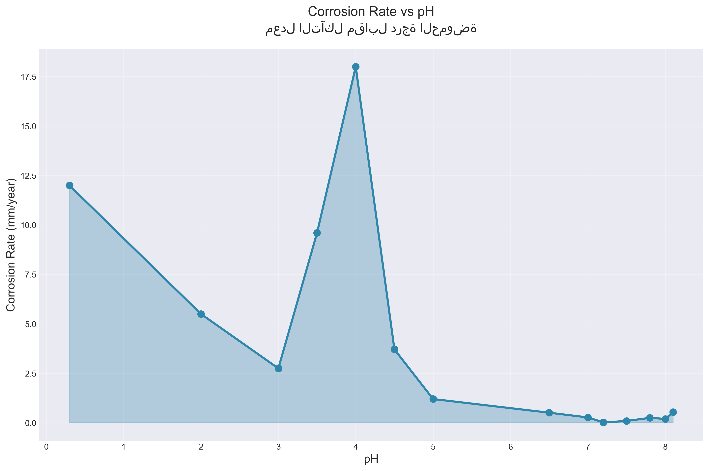

# دليل إنشاء الرسوم البيانية للورقة البحثية

## نظرة عامة

هذا السكريبت (`generate_visualizations.py`) يقوم بإنشاء رسوم بيانية احترافية من البيانات الموجودة في قاعدة البيانات ويمكن استخدامها مباشرة في الورقة البحثية.

## المتطلبات

تأكد من تثبيت المكتبات المطلوبة:

```bash
cd backend
pip install matplotlib seaborn pandas numpy
```

أو قم بتثبيت جميع المتطلبات:

```bash
pip install -r requirements.txt
```

## كيفية الاستخدام

### 1. التأكد من وجود البيانات

تأكد من أنك قمت برفع ملف CSV إلى قاعدة البيانات أولاً من خلال:
- التطبيق المحمول (Flutter)
- لوحة التحكم الويب (`http://localhost:5001/dashboard`)

### 2. تشغيل السكريبت

```bash
cd backend
python generate_visualizations.py
```

### 3. المخرجات

سيتم إنشاء مجلد `research_visualizations/` يحتوي على جميع الرسوم البيانية:

1. **1_corrosion_vs_ph.png** - معدل التآكل مقابل pH
2. **2_corrosion_vs_temperature.png** - معدل التآكل مقابل درجة الحرارة
3. **3_corrosion_vs_medium.png** - معدل التآكل مقابل الوسط
4. **4_material_comparison.png** - مقارنة المواد
5. **5_corrosion_vs_nacl.png** - معدل التآكل مقابل تركيز NaCl
6. **6_3d_surface_plot.png** - رسم ثلاثي الأبعاد (Temperature vs pH vs Corrosion Rate)
7. **7_statistics_summary.png** - ملخص إحصائي
8. **8_correlation_heatmap.png** - مصفوفة الارتباط

## الرسوم البيانية المتولدة

### 1. معدل التآكل مقابل pH
- رسم بياني خطي يوضح العلاقة بين درجة الحموضة ومعدل التآكل
- يظهر منحنى على شكل U مقلوب

### 2. معدل التآكل مقابل درجة الحرارة
- رسم بياني خطي يوضح العلاقة الأسية بين درجة الحرارة ومعدل التآكل
- يتبع علاقة Arrhenius

### 3. معدل التآكل مقابل الوسط
- رسم بياني عمودي يوضح الفرق في معدل التآكل بين الأوساط المختلفة
- يعرض أعلى 10 أوساط

### 4. مقارنة المواد
- رسم بياني أفقي يوضح الفرق في معدل التآكل بين أنواع المواد
- يظهر عدد العينات لكل مادة

### 5. معدل التآكل مقابل تركيز NaCl
- رسم بياني مبعثر مع خط الاتجاه
- يوضح العلاقة الخطية بين تركيز NaCl ومعدل التآكل

### 6. الرسم ثلاثي الأبعاد
- سطح ثلاثي الأبعاد يوضح العلاقة بين درجة الحرارة و pH ومعدل التآكل
- مفيد للفهم الشامل للعلاقات

### 7. الملخص الإحصائي
- جدول يوضح الإحصائيات الأساسية للبيانات
- يشمل المتوسط، القيم الدنيا والعليا، الانحراف المعياري

### 8. مصفوفة الارتباط
- خريطة حرارية توضح الارتباط بين المتغيرات المختلفة
- يساعد في فهم العلاقات بين العوامل

## مواصفات الصور

- **الدقة**: 300 DPI (مناسبة للطباعة)
- **الصيغة**: PNG
- **الحجم**: محسّن للورقة البحثية
- **الألوان**: احترافية ومناسبة للطباعة

## استخدام الصور في الورقة البحثية

### في Markdown:

```markdown

```

### في LaTeX:

```latex
\begin{figure}[h]
    \centering
    \includegraphics[width=0.8\textwidth]{research_visualizations/1_corrosion_vs_ph.png}
    \caption{معدل التآكل مقابل درجة الحموضة}
    \label{fig:ph_vs_corrosion}
\end{figure}
```

### في Word:

1. انسخ الصور من مجلد `research_visualizations/`
2. الصقها في Word
3. اضبط الحجم والموضع حسب الحاجة

## تخصيص الرسوم البيانية

يمكنك تعديل السكريبت لتخصيص:
- الألوان
- الأحجام
- الخطوط
- العناوين
- التنسيق

## استكشاف الأخطاء

### خطأ: "No data available"
- تأكد من رفع ملف CSV إلى قاعدة البيانات
- تحقق من اتصال قاعدة البيانات في `.env`

### خطأ: "Module not found"
- قم بتثبيت المكتبات المطلوبة: `pip install matplotlib seaborn`

### خطأ: "Database connection failed"
- تحقق من إعدادات قاعدة البيانات في `.env`
- تأكد من أن MySQL يعمل

## ملاحظات

- الصور تُحفظ بدقة عالية (300 DPI) مناسبة للطباعة
- جميع الرسوم البيانية تحتوي على عناوين بالعربية والإنجليزية
- الألوان محسّنة للطباعة بالأبيض والأسود والملون

---

**تاريخ الإنشاء**: [التاريخ الحالي]

