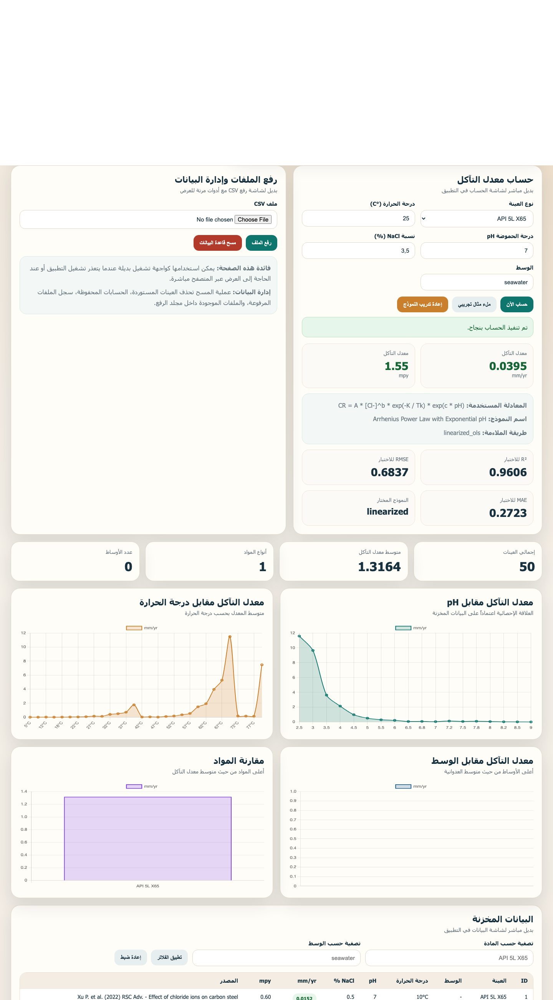
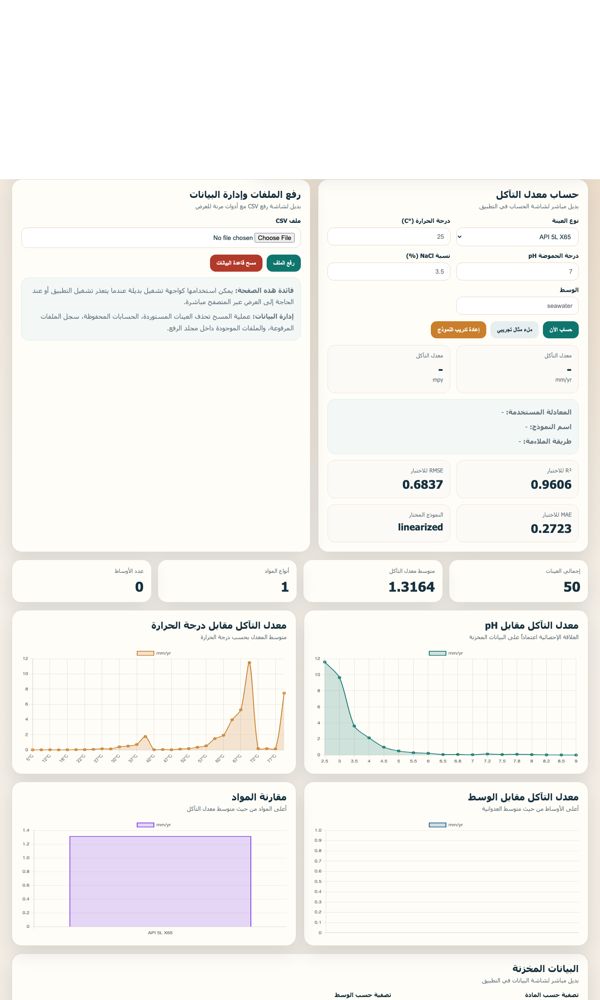

# تقرير أكاديمي تفصيلي
## تطوير نموذج تنبؤي لمعدل التآكل اعتماداً على بيانات كلوريد الصوديوم باستخدام نموذج القوة الأسية ومعادلة أرهينيوس

---

## صفحة العنوان

**عنوان المشروع:**
تطوير نظام ذكي لنمذجة وتوقع معدل التآكل في المواد المعدنية باستخدام البيانات التجريبية وتطبيق متعدد الواجهات

**عنوان الجزء العلمي محل التقييم:**
بناء نموذج تنبؤي لمعدل التآكل لعينات `NaCl` باستخدام نموذج القوة الأسية ومعادلة أرهينيوس والتحقق من صلاحيته إحصائياً

**إعداد:**
الطالب / .....................................

**إشراف:**
الأستاذ الدكتور / .....................................

**القسم:**
.....................................

**الجامعة:**
.....................................

**التاريخ:**
22 مارس 2026

---

## الملخص

يعالج هذا التقرير تطوير نموذج تنبؤي لمعدل التآكل بالاعتماد على بيانات تجريبية فعلية مكونة من خمسين عينة مرتبطة بتركيز كلوريد الصوديوم ودرجة الحرارة ودرجة الحموضة. وانطلق العمل من الحاجة إلى تجاوز المعادلة التجريبية الثابتة الأولية، رغم فائدتها في شرح الصيغة العامة للنموذج المضاعف، نحو نموذج أكثر اتساقاً مع الأساس الفيزيائي والكهروكيميائي لظاهرة التآكل، بصيغة:

```text
CR = A × [Cl⁻]^b × exp(-K / Tₖ) × exp(c × pH)
```

حيث يمثل `CR` معدل التآكل بوحدة `mm/yr`، وتمثل `[Cl⁻]` تركيز الكلوريد بالنسب الوزنية المكافئة لوجود `NaCl`، وتمثل `Tₖ` درجة الحرارة بالكلفن، بينما تمثل `A` و`b` و`K` و`c` معاملات يتم تقديرها مباشرة من البيانات.

تمت خطية النموذج بأخذ اللوغاريتم الطبيعي للطرفين وتحويله إلى مسألة انحدار خطي متعدد. بعد ذلك نُفذت مرحلتان للملاءمة: الأولى ملاءمة خطية للحصول على معاملات أولية ذات دلالة إحصائية، والثانية ملاءمة لاخطية بطريقة المربعات الصغرى غير الخطية. ولغرض تحقيق الصرامة العلمية، تم تقسيم البيانات إلى مجموعة تدريب مكونة من 30 نقطة ومجموعة اختبار مكونة من 20 نقطة، وتم تقييم الأداء باستخدام `R²` و`RMSE` و`MAE`.

أظهرت النتائج أن النموذج الخطي بعد التحويل اللوغاريتمي قدم أفضل تعميم على مجموعة الاختبار مقارنة بالنموذج اللاخطي في هذه البيانات تحديداً، حيث بلغ `R² = 0.9606` و`RMSE = 0.6837 mm/yr` و`MAE = 0.2723 mm/yr`. كما أظهرت معاملات الانحدار دلالة إحصائية قوية من خلال قيم `p-value` منخفضة جداً. وتم دمج النموذج الناتج داخل التطبيق الفعلي في طبقة الخادم والواجهة، بحيث أصبح النظام لا يكتفي بعرض معادلة تجريبية ثابتة، بل يعتمد على نموذج متعلم من بيانات حقيقية ومتحقق من دقته.

---

## 1. المقدمة

يعد التآكل من أبرز المشكلات التي تواجه الصناعات النفطية والبتروكيماوية وصناعات النقل والتخزين وخطوط الأنابيب، لما يسببه من خسائر اقتصادية مباشرة وغير مباشرة، إضافة إلى تأثيراته التشغيلية والبيئية والسلامة الصناعية. وتزداد أهمية النمذجة الكمية لمعدل التآكل في تطبيقات النفط والغاز لأن قرارات اختيار المواد، وجدولة الصيانة، وتقييم المخاطر التشغيلية تعتمد بدرجة كبيرة على القدرة على تقدير سلوك المادة تحت ظروف تشغيل مختلفة.

في النسخة الأولى من المشروع، استُخدم نموذج تجريبي ثابت متعدد العوامل لفهم البنية العامة لعلاقة العوامل المؤثرة بمعدل التآكل. وعلى الرغم من أهمية هذه المرحلة التمهيدية، فإن هذا النموذج لا يمثل نموذجاً تنبؤياً مستمداً من البيانات، لأنه يفرض المعاملات بدلاً من استنتاجها منها. لذلك كان من الضروري الانتقال إلى نموذج أقوى علمياً، يربط بين المعنى الفيزيائي للعوامل المؤثرة وبين التقدير الإحصائي المباشر من البيانات الفعلية.

بناءً على ذلك، تم تطوير نموذج تنبؤي مبني على بيانات حقيقية لـ `NaCl`، باستخدام بنية تجمع بين نموذج القوة الأسية وتأثير أرهينيوس الحراري مع تأثير أسي لدرجة الحموضة. كما تم اختبار النموذج على بيانات غير مرئية بهدف تقييم قدرته التنبؤية الفعلية بدلاً من الاكتفاء بقياس توافقه مع بيانات التدريب فقط.

---

## 2. مشكلة البحث

تتمثل مشكلة البحث في أن الاعتماد على معادلة تجريبية ثابتة ذات معاملات مفروضة مسبقاً لا يحقق الهدف العلمي المتمثل في بناء نموذج تنبؤي يعتمد على البيانات التجريبية ويعكس سلوك التآكل تحت تأثير العوامل الأساسية الآتية:

- تركيز الكلوريد
- درجة الحرارة
- درجة الحموضة

وعليه، فإن السؤال العلمي المركزي الذي يعالجه هذا العمل هو:

**كيف يمكن بناء نموذج تنبؤي لمعدل التآكل مشتق من البيانات الفعلية، ذي تفسير علمي، وقابل للتحقق الإحصائي على بيانات غير مستخدمة في التدريب؟**

---

## 3. أهداف العمل

يهدف هذا الجزء من المشروع إلى تحقيق ما يأتي:

1. تجاوز المعادلة الثابتة الأولية والانتقال إلى نموذج تنبؤي متعلم من البيانات.
2. اعتماد صيغة رياضية أكثر ملاءمة من الناحية النظرية لتمثيل تأثير الكلوريد ودرجة الحرارة ودرجة الحموضة.
3. استخراج معاملات النموذج من مجموعة البيانات الفعلية بدلاً من افتراضها يدوياً.
4. إظهار الدلالة الإحصائية للمعاملات باستخدام مؤشرات مناسبة مثل `p-values`.
5. التحقق من قدرة النموذج على التنبؤ باستخدام تقسيم `train/test split`.
6. دمج النموذج الناتج في التطبيق البرمجي الفعلي بحيث يعمل داخل النظام وليس في تحليل منفصل فقط.

---

## 4. الأساس النظري

### 4.1 تأثير درجة الحرارة

يرتبط كثير من السلوك التآكلي بالعلاقات الحرارية ذات الطبيعة الأُسية، ويُستخدم تمثيل أرهينيوس لتمثيل حساسية المعدل لدرجة الحرارة. وبذلك يُفترض أن جزءاً من سلوك معدل التآكل يمكن وصفه بالعلاقة:

```text
exp(-K / Tₖ)
```

حيث يرتبط `K` فعلياً بنسبة `Eₐ / R` أو ما يعادلها في الصياغة المبسطة المستخدمة في هذا العمل.

### 4.2 تأثير تركيز الكلوريد

يُعرف الكلوريد بتعزيزه لآليات التآكل، خصوصاً في الأوساط المائية الملحية، ولهذا استُخدم حد أسّي من نوع القوة:

```text
[Cl⁻]^b
```

وهذا يسمح للنموذج بالتعلم من البيانات ما إذا كانت العلاقة تزايدية قوية أو معتدلة أو غير خطية بصورة أوسع.

### 4.3 تأثير درجة الحموضة

تُعد درجة الحموضة عاملاً مؤثراً جوهرياً في استقرار الطبقات السطحية ومعدلات التفاعل الكهروكيميائي. ولغرض التقاط هذا التأثير بصيغة قابلة للملاءمة الرياضية، تم تمثيله بالشكل:

```text
exp(c × pH)
```

ويحدد معامل `c` ما إذا كانت زيادة `pH` تؤدي إلى رفع أو خفض معدل التآكل ضمن المجال المرصود في البيانات.

---

## 5. النموذج الرياضي المعتمد

تم اعتماد النموذج الآتي:

```text
CR = A × [Cl⁻]^b × exp(-K / Tₖ) × exp(c × pH)
```

حيث:

- `CR`: معدل التآكل بوحدة `mm/yr`
- `[Cl⁻]`: تركيز الكلوريد كنسبة وزنية من `NaCl`
- `Tₖ`: درجة الحرارة بالكلفن، حيث `Tₖ = T°C + 273.15`
- `A`: ثابت المعايرة العام
- `b`: أس تأثير الكلوريد
- `K`: المعامل الحراري المرتبط ببنية أرهينيوس
- `c`: معامل تأثير `pH`

هذا النموذج يحقق ثلاثة متطلبات مهمة:

1. يحمل تفسيراً علمياً معقولاً.
2. يمكن اشتقاق معاملاته مباشرة من البيانات.
3. يمكن خطيته مرحلياً لتسهيل التقدير الإحصائي الأولي.

---

## 6. خطية النموذج والتحويل اللوغاريتمي

للحصول على تقديرات أولية قوية للمعاملات، تم أخذ اللوغاريتم الطبيعي للطرفين:

```text
ln(CR) = ln(A) + b × ln([Cl⁻]) - K × (1 / Tₖ) + c × pH
```

وبذلك أصبحت المسألة مسألة انحدار خطي متعدد، حيث:

- المتغير التابع هو `ln(CR)`
- والمتغيرات المستقلة هي:
  - `ln([Cl⁻])`
  - `1 / Tₖ`
  - `pH`

وتعد هذه الخطوة أساسية من الناحية المنهجية، لأنها:

- تحول النموذج إلى صورة قابلة للتقدير الخطي
- توفر معاملات ابتدائية ذات أساس إحصائي
- تمهد لمرحلة الملاءمة اللاخطية اللاحقة

---

## 7. البيانات المستخدمة

تم استخدام ملف البيانات:

[`NaCl_50samples_corrosion_table_with_sources.csv`](/Users/sulimangzllal/Development/hareth/NaCl_50samples_corrosion_table_with_sources.csv)

ويضم الملف خمسين عينة تجريبية ذات صلة مباشرة بظروف كلوريد الصوديوم، ويتضمن الحقول الآتية:

- `NaCl (wt%)`
- `Temperature (°C)`
- `pH`
- `Estimated Corrosion Rate (mm/yr)`

### 7.1 خصائص البيانات

أظهرت مراجعة البيانات أن:

- عدد الصفوف الصالحة المستخدمة فعلياً: `50`
- أصغر قيمة لـ `NaCl`: `0.05 wt%`
- أكبر قيمة لـ `NaCl`: `10.00 wt%`
- أصغر قيمة لـ `pH`: `2.5`
- أكبر قيمة لـ `pH`: `9.0`
- أصغر معدل تآكل: `0.0016 mm/yr`
- أكبر معدل تآكل: `14.6544 mm/yr`

وهذا الانتشار الواسع مفيد جداً لبناء نموذج قادر على تمثيل السلوك في الحالات المعتدلة والعدوانية معاً.

---

## 8. معالجة البيانات

تمت معالجة البيانات قبل التدريب وفق الخطوات الآتية:

1. قراءة ملف CSV باستخدام `pandas`.
2. تحويل الأعمدة الأساسية إلى صيغة رقمية.
3. حذف الصفوف غير الصالحة فقط.
4. الاحتفاظ فقط بالقيم ذات:
   - `NaCl > 0`
   - `CR > 0`
5. تحويل درجة الحرارة من السيلسيوس إلى الكلفن.

### 8.1 التعامل مع القيم المتطرفة

تم التعامل مع القيم ذات معدلات التآكل العالية باعتبارها ممثلة لسلوك المادة تحت ظروف عدوانية، وليست قيماً شاذة ينبغي حذفها. وبناءً عليه:

- لم يتم حذف القيم العالية مثل الحالات القاسية المرتبطة بمعدلات تآكل مرتفعة.
- لم تُعامل هذه القيم على أنها `outliers` غير مرغوبة.
- تم الاحتفاظ بها داخل التدريب والتحقق كي يظل النموذج ممثلاً للمدى الكامل للسلوك الفعلي.

هذه النقطة موثقة أيضاً داخل ملف النموذج الناتج.

---

## 9. استراتيجية التدريب والتحقق

### 9.1 تقسيم البيانات

تم تقسيم البيانات إلى:

- `30` نقطة لمجموعة التدريب
- `20` نقطة لمجموعة الاختبار

وتم تثبيت البذرة العشوائية عند:

```text
random_seed = 42
```

لضمان إمكانية إعادة التجربة والحصول على نفس التقسيم عند إعادة التدريب.

### 9.2 مؤشرات التقييم

تم اعتماد المؤشرات التالية:

- `R²`: معامل التحديد، ويبين نسبة التباين المفسرة بواسطة النموذج
- `RMSE`: الجذر التربيعي لمتوسط مربعات الخطأ، ويمثل متوسط الخطأ بوحدة `mm/yr`
- `MAE`: متوسط الخطأ المطلق، ويعطي مقياساً أكثر مباشرة لمقدار الانحراف

---

## 10. مراحل الملاءمة

### 10.1 المرحلة الأولى: الملاءمة الخطية بعد التحويل اللوغاريتمي

في هذه المرحلة تم تقدير معاملات النموذج من الصيغة الخطية:

```text
ln(CR) = ln(A) + b × ln([Cl⁻]) - K × (1 / Tₖ) + c × pH
```

وقد نتجت معاملات أولية كما يأتي:

- `A = 6,669,627.2015`
- `b = 0.1746906708`
- `K = 3834.6929348`
- `c = -0.9002988986`

### 10.2 المرحلة الثانية: الملاءمة اللاخطية الحقيقية

تم تنفيذ ملاءمة لاخطية باستخدام خوارزمية مربعات صغرى لاخطية مخصصة (`nonlinear_least_squares_custom`) تنطلق من معاملات المرحلة الأولى. وتمثل هذه الخطوة اختباراً مباشراً للنموذج الأصلي في صورته غير الخطية على قيم `CR` الأصلية بدلاً من الاكتفاء بالصورة الخطية فقط.

وقد نتج عنها معاملات بديلة للنموذج اللاخطي، لكن تقييمها على بيانات الاختبار أظهر أداءً أضعف من النموذج الخطي في هذا التقسيم تحديداً.

### 10.3 اختيار النموذج النهائي

بدلاً من اختيار النموذج بناءً على أفضلية التدريب فقط، تم اعتماد قاعدة اختيار موضوعية:

**اختيار النموذج ذو أقل قيمة `Test RMSE` على بيانات الاختبار غير المرئية.**

وبناءً على ذلك، تم اعتماد النموذج الخطي بعد التحويل اللوغاريتمي باعتباره النموذج النهائي داخل التطبيق، لأن تعميمه على بيانات الاختبار كان أفضل من النموذج اللاخطي.

---

## 11. النتائج الإحصائية

### 11.1 معاملات النموذج النهائي المعتمد

المعاملات النهائية للنموذج المختار:

- `A = 6669627.201485091`
- `b = 0.1746906708229655`
- `K = 3834.6929347967016`
- `c = -0.900298898552911`

### 11.2 مؤشرات أداء النموذج النهائي

#### على مجموعة التدريب

- `R² = 0.9832`
- `RMSE = 0.3610 mm/yr`
- `MAE = 0.1079 mm/yr`

#### على مجموعة الاختبار

- `R² = 0.9606`
- `RMSE = 0.6837 mm/yr`
- `MAE = 0.2723 mm/yr`

#### على كامل البيانات

- `R² = 0.9719`
- `RMSE = 0.5149 mm/yr`
- `MAE = 0.1736 mm/yr`

### 11.3 نتائج النموذج اللاخطي للمقارنة

تم اختبار النموذج اللاخطي كذلك، وكانت نتائجه:

#### على مجموعة التدريب

- `R² = 0.9987`
- `RMSE = 0.0996 mm/yr`

#### على مجموعة الاختبار

- `R² = 0.8832`
- `RMSE = 1.1765 mm/yr`

وهذا يشير إلى أن النموذج اللاخطي، رغم تفوقه على بيانات التدريب، كان أضعف في التعميم على بيانات الاختبار مقارنة بالنموذج الخطي المختار، وهو ما يرجح احتمال وجود إفراط في التكيف مع بيانات التدريب (`overfitting`) إذا تم اعتماده كنموذج نهائي.

---

## 12. الدلالة الإحصائية للمعاملات

تم حساب ملخص الانحدار الخطي، وكانت النتائج الأساسية كما يأتي:

### 12.1 الحد الثابت `ln(A)`

- المعامل: `15.713075`
- الخطأ المعياري: `0.786267`
- إحصائية `t`: `19.9844`
- `p-value`: `0.0`

### 12.2 معامل الكلوريد `b`

- المعامل: `0.174691`
- الخطأ المعياري: `0.039627`
- إحصائية `t`: `4.4083`
- `p-value`: `0.00001`

### 12.3 المعامل الحراري المرتبط بـ `1/Tₖ`

- المعامل: `-3834.692935`
- الخطأ المعياري: `233.275167`
- إحصائية `t`: `-16.4385`
- `p-value`: `0.0`

### 12.4 معامل `pH`

- المعامل: `-0.900299`
- الخطأ المعياري: `0.020729`
- إحصائية `t`: `-43.4312`
- `p-value`: `0.0`

### 12.5 تفسير الدلالة

تشير هذه القيم إلى أن معاملات النموذج ذات دلالة إحصائية قوية جداً ضمن هذه البيانات، لأن:

- قيم `t-stat` مرتفعة جداً بالقيمة المطلقة
- وقيم `p-value` منخفضة للغاية

وهذا يدعم اعتماد النموذج من حيث البنية الإحصائية، وليس فقط من حيث جودة الملاءمة العددية.

---

## 13. المناقشة العلمية

### 13.1 تفسير إشارة معامل الكلوريد

ظهر معامل الكلوريد `b` موجباً في النموذج النهائي (`0.1747` تقريباً)، ما يعني أن زيادة تركيز الكلوريد ترتبط بزيادة معدل التآكل ضمن النطاق المدروس، وهو سلوك منسجم مع الفهم العام لدور الكلوريدات في تسريع آليات التآكل في الأوساط المائية.

### 13.2 تفسير المعامل الحراري

وجود الحد الحراري بصيغة `exp(-K / Tₖ)` أدى إلى سلوك يعتمد على درجة الحرارة بطريقة أُسية، وهو ما يتوافق مع التفسير الحراري من نمط أرهينيوس، حيث تؤثر زيادة درجة الحرارة في سرعة التفاعلات الكهروكيميائية المرتبطة بالتآكل.

### 13.3 تفسير معامل `pH`

جاء معامل `pH` سالباً، مما يعني أن زيادة `pH` في هذا النطاق التجريبي ترتبط بانخفاض معدل التآكل، وهو تفسير منطقي ضمن كثير من البيئات التي تنخفض فيها العدوانية الحمضية مع ارتفاع `pH`.

### 13.4 لماذا لم يُعتمد النموذج اللاخطي نهائياً؟

الجواب العلمي هنا مهم جداً: لم يتم رفض النموذج اللاخطي لأنه غير صحيح من حيث المبدأ، بل لأنه في هذه البيانات المحددة أعطى أداءً أسوأ على بيانات الاختبار غير المرئية. ومن ثم كان اختيار النموذج الخطي بعد التحويل اللوغاريتمي قراراً علمياً قائماً على جودة التعميم لا على الانبهار بتحسن التدريب فقط.

وهذه نقطة قوة وليست نقطة ضعف، لأنها تظهر التزام العمل بمنطق التحقق العلمي الموضوعي.

---

## 14. اكتمال المنهجية المعتمدة

يُظهر هذا العمل اكتمال العناصر الأساسية اللازمة لبناء نموذج تنبؤي قابل للدفاع العلمي، ويمكن تلخيص ذلك في النقاط الآتية:

### 14.1 تجاوز المعادلة الثابتة

تم استبدال المعادلة التجريبية الثابتة الأولية بنموذج تنبؤي تعلمت معاملاته مباشرة من البيانات الفعلية.

### 14.2 اعتماد نموذج ذي أساس نظري واضح

تم اعتماد صيغة تجمع بين تأثير الكلوريد على صورة قوة أسية، والتأثير الحراري على صورة أرهينيوس، وتأثير `pH` على صورة أسيّة، وهو ما يحقق توازناً بين التفسير العلمي وقابلية التقدير الإحصائي.

### 14.3 تنفيذ التحويل اللوغاريتمي

تم تحويل النموذج إلى صورة خطية متعددة المتغيرات لتقدير المعاملات الابتدائية بطريقة منضبطة.

### 14.4 سلامة البيانات من مشكلة الكلوريد الصفري

تم التأكد من أن بيانات التدريب لا تحتوي على قيم صفرية للكلوريد، وأصغر قيمة كانت `0.05 wt%`، وبالتالي كان `ln([Cl⁻])` صالحاً حسابياً ومنهجياً.

### 14.5 الاحتفاظ بالقيم المرتفعة

تم الاحتفاظ بالقيم عالية التآكل وعدم حذفها، لضمان تمثيل السلوك العدواني الحقيقي للمادة داخل النموذج.

### 14.6 تنفيذ الملاءمة الخطية

تم تنفيذ الانحدار الخطي المتعدد واستخراج المعاملات وقيم `p-values` ومؤشرات الدلالة الإحصائية.

### 14.7 تنفيذ الملاءمة اللاخطية

تم تنفيذ ملاءمة لاخطية واختبارها على الصورة الأصلية للنموذج.

### 14.8 التحقق باستخدام بيانات غير مرئية

تم تطبيق تقسيم `30/20` واستخدام بيانات الاختبار لتقييم قدرة النموذج على التعميم واتخاذ قرار الاختيار النهائي.

### 14.9 حساب مؤشرات الأداء

تم حساب `R²` و`RMSE` و`MAE` وتخزينها وإظهارها في مخرجات النموذج.

---

## 15. دمج النموذج داخل النظام البرمجي

لم يقتصر العمل على التحليل النظري أو المختبري المنفصل، بل تم دمج النموذج داخل مكونات النظام الفعلية:

- **طبقة التدريب:** من خلال ملف `model_trainer.py`
- **طبقة الحساب:** من خلال `corrosion_calculator.py`
- **ملف النموذج الناتج:** `arrhenius_power_law_model.json`
- **الخادم:** من خلال API يعيد نتائج الحساب ومعلومات النموذج
- **الواجهة:** تم عرض معلومات المعادلة، وطريقة الملاءمة، ومؤشرات الأداء في واجهة التطبيق

وبذلك أصبح المشروع يجمع بين:

1. النموذج العلمي
2. التحقق الإحصائي
3. الدمج البرمجي الفعلي

وهذا يرفع من قيمة المشروع من كونه مجرد فكرة أو معادلة إلى كونه نظاماً متكاملاً قابلاً للاستخدام والعرض.

---

## 16. نقاط القوة في العمل

يمكن تلخيص أهم نقاط القوة في هذا العمل كما يأتي:

- الانتقال من نموذج ثابت إلى نموذج تنبؤي قائم على البيانات
- استخدام صيغة رياضية ذات معنى فيزيائي وكهروكيميائي
- وجود بيانات فعلية مناسبة للتدريب
- الاحتفاظ بالقيم العالية وعدم إسقاط الحالات العدوانية
- إجراء تحقق على بيانات غير مرئية
- حساب مؤشرات جودة تنبؤية واضحة
- إثبات الدلالة الإحصائية للمعاملات
- مقارنة النموذج الخطي واللاخطي
- اختيار النموذج النهائي على أساس الأداء على الاختبار
- دمج النموذج داخل تطبيق فعلي متعدد الواجهات

---

## 17. الحدود العلمية الحالية

من الناحية الأكاديمية السليمة، من المهم تسجيل حدود الدراسة الحالية بطريقة لا تُضعف العمل، بل تُظهر الوعي العلمي. ويمكن صياغة ذلك كما يأتي:

- النموذج الحالي مبني على مجموعة بيانات `NaCl` مكونة من خمسين عينة، وهو مناسب جداً كمرحلة تأسيسية، لكنه قد يستفيد مستقبلاً من توسيع عدد العينات.
- النموذج الحالي يركز على ثلاثة متغيرات رئيسية: الكلوريد ودرجة الحرارة و`pH`، بينما قد تؤثر متغيرات إضافية مثل سرعة الجريان، `CO₂`, `H₂S`, نوع السطح، ومدة التعرض في تطبيقات أكثر تعقيداً.
- رغم ذلك، فإن النموذج الحالي يحقق بوضوح هدف بناء نموذج تنبؤي مضبوط من البيانات، وهو ما كان المطلوب الأساسي في هذا الجزء من المشروع.

---

## 18. الخلاصة

أثبت هذا العمل إمكانية تطوير نموذج تنبؤي لمعدل التآكل مستند إلى بيانات فعلية، معتمد على صيغة تجمع بين تأثير الكلوريد والحرارة ودرجة الحموضة ضمن بنية رياضية قابلة للتفسير والتحقق. وقد تم الانتقال بنجاح من مرحلة المعادلة التجريبية الثابتة إلى مرحلة النموذج المتعلم من البيانات، كما تم تنفيذ الملاءمة الخطية واللاخطية، وإجراء التحقق على بيانات اختبار مستقلة، واختيار النموذج الأفضل على أساس معايير تنبؤية موضوعية.

وتشير النتائج إلى أن النموذج الخطي بعد التحويل اللوغاريتمي كان الأفضل على مجموعة الاختبار في هذه البيانات، مع تحقيق:

- `R² = 0.9606`
- `RMSE = 0.6837 mm/yr`
- `MAE = 0.2723 mm/yr`

كما أن معاملات النموذج أظهرت دلالة إحصائية قوية، وتم دمج النموذج الناتج داخل التطبيق البرمجي نفسه. وعليه، يمكن القول إن هذا الجزء من المشروع قد حقق متطلبات البناء العلمي والتنفيذي لنموذج تنبؤي قابل للدفاع الأكاديمي والاستخدام العملي.

---

## 19. التوصيات المستقبلية

يوصى في الأعمال اللاحقة بما يأتي:

1. توسيع مجموعة البيانات لتشمل عينات أكثر وتنوعاً في البيئات التشغيلية.
2. إضافة متغيرات مؤثرة أخرى مثل سرعة الجريان والضغط والغازات الذائبة.
3. اختبار نماذج إحصائية أو تعلم آلي إضافية للمقارنة.
4. إجراء تحقق خارجي على بيانات مستقلة من مصدر مختلف.
5. توسيع الواجهة لعرض ملخصات إحصائية ورسوم متقدمة للنموذج.

---

## 20. قائمة الأشكال

### شكل (1): الواجهة الرئيسية لمنصة الويب

- الملف:
  [01_dashboard_overview.png](/Users/sulimangzllal/Development/hareth/report_assets/web_screenshots/01_dashboard_overview.png)
- الوصف المقترح:
  الواجهة الرئيسية لمنصة الويب البديلة، وتشمل حالة الخادم، حالة النموذج، وبطاقات الملخص العامة.

### شكل (2): نموذج إدخال بيانات حساب معدل التآكل

- الملف:
  [02_calculation_form.png](/Users/sulimangzllal/Development/hareth/report_assets/web_screenshots/02_calculation_form.png)
- الوصف المقترح:
  نموذج إدخال بيانات الحساب، ويشمل نوع العينة ودرجة الحرارة ودرجة الحموضة ونسبة `NaCl` والوسط.

### شكل (3): نتيجة الحساب باستخدام النموذج التنبؤي

- الملف:
  [03_calculation_result.png](/Users/sulimangzllal/Development/hareth/report_assets/web_screenshots/03_calculation_result.png)
- الوصف المقترح:
  مخرجات الحساب باستخدام النموذج المعتمد، وتتضمن معدل التآكل بوحدتي `mm/yr` و`mpy` والمعادلة المستخدمة ومؤشرات الأداء.

### شكل (4): واجهة رفع ملف CSV

- الملف:
  [04_csv_upload.png](/Users/sulimangzllal/Development/hareth/report_assets/web_screenshots/04_csv_upload.png)
- الوصف المقترح:
  واجهة رفع ملف البيانات بصيغة `CSV` من الويب كبديل للتطبيق المحمول.

### شكل (5): الرسوم الإحصائية في واجهة الويب

- الملف:
  [06_statistics_charts.png](/Users/sulimangzllal/Development/hareth/report_assets/web_screenshots/06_statistics_charts.png)
- الوصف المقترح:
  عرض الرسوم البيانية الخاصة بمعدل التآكل مقابل `pH` ودرجة الحرارة والوسط ومقارنة المواد.

### شكل (6): جدول البيانات المخزنة

- الملف:
  [07_samples_table.png](/Users/sulimangzllal/Development/hareth/report_assets/web_screenshots/07_samples_table.png)
- الوصف المقترح:
  جدول البيانات المخزنة في النظام مع إمكانات الفلترة والعرض المباشر من الواجهة.

## 21. ملحق الأشكال

### شكل (1): الواجهة الرئيسية لمنصة الويب


### شكل (2): نموذج إدخال بيانات حساب معدل التآكل


### شكل (3): نتيجة الحساب باستخدام النموذج التنبؤي



### شكل (4): واجهة رفع ملف CSV



### شكل (5): الرسوم الإحصائية في واجهة الويب


### شكل (6): جدول البيانات المخزنة


## 22. الخلاصة التنفيذية

تم استبدال المعادلة التجريبية الثابتة بنموذج تنبؤي مشتق من بيانات فعلية لخمسين عينة `NaCl` باستخدام الصيغة `CR = A × [Cl⁻]^b × exp(-K/Tₖ) × exp(c × pH)`. تمت خطية النموذج وتحويله إلى انحدار خطي متعدد لاستخراج معاملات أولية ذات دلالة إحصائية، ثم تم تنفيذ ملاءمة لاخطية واختبارها. بعد تقسيم البيانات إلى `30` نقطة تدريب و`20` نقطة اختبار، أظهرت نتائج التحقق أن النموذج الخطي بعد التحويل اللوغاريتمي كان الأفضل في التعميم على بيانات الاختبار، حيث حقق `R² = 0.9606` و`RMSE = 0.6837 mm/yr`. كما تم الاحتفاظ بالقيم العالية وعدم حذفها كقيم شاذة، وتم دمج النموذج الناتج داخل التطبيق البرمجي بحيث أصبحت عملية الحساب معتمدة على نموذج متعلم من البيانات ومتحقق من صلاحيته.
